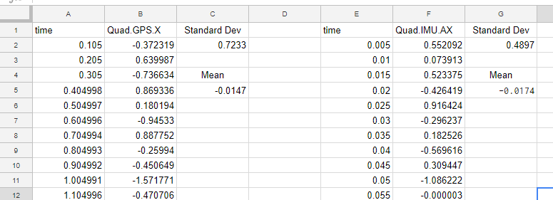
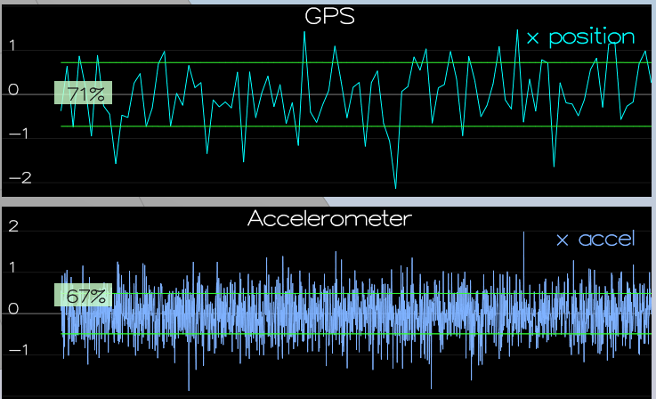
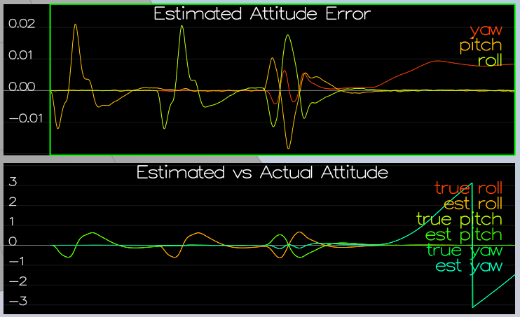
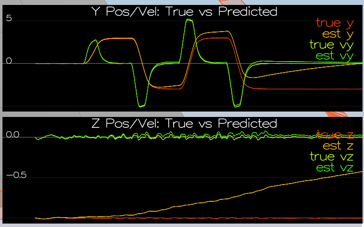
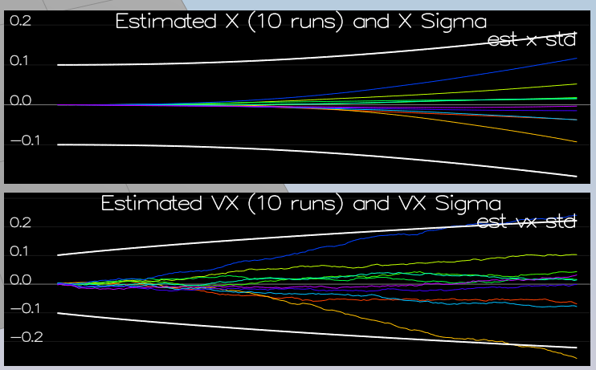
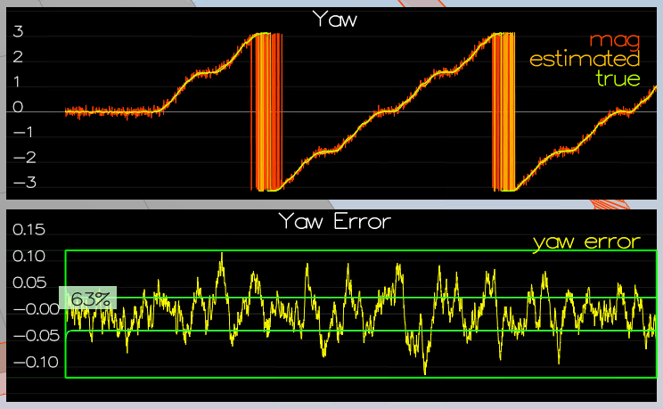

# FCND-Estimation-CPP project Submission #

Submission for the FCND-Estimation-CPP project for Philippe Doucette.

### Step 1: Sensor Noise ###
***Determine the standard deviation of the measurement noise of both GPS X data and Accelerometer X data.***

The calculated standard deviation correctly captures ~68% of the sensor measurements. 

The quad simulator was run under scenario `06_SensorNoise` to generate log files `\config\log\Graph1` and `\config\log\Graph2`.  This data was pulled into a spreadsheet and analyzed to generate standard deviation:



These standard deviations were plugged into `config/6_SensorNoise.txt` by updating `MeasuredStdDev_GPSPosXY` and `MeasuredStdDev_AccelXY`.
```
MeasuredStdDev_GPSPosXY = 0.723312024
MeasuredStdDev_AccelXY = 0.4897387239
```

Running the sumulator again, indicates successful capture of 68% of respective measurements:




### Step 2: Attitude Estimation ###
***Implement a better rate gyro attitude integration scheme in the `UpdateFromIMU()` function.***

The improved integration scheme results in an attitude estimator of < 0.1 rad for each of the Euler angles for a duration of at least 3 seconds during the simulation. 

The integration scheme used quaternions to improve performance over the current simple integration scheme.
```C++
UpdateFromIMU(V3F accel, V3F gyro)
  float yawEst; 
  Quaternion<float> rotationStatePyor;
  Quaternion<float> rotationState;
  
  yawEst = ekfState(6);
  rotationStatePyor = Quaternion<float>:: FromEuler123_RPY(rollEst, pitchEst, yawEst);
  rotationState = rotationStatePyor.IntegrateBodyRate(gyro.getArray(), dtIMU);

  float predictedPitch = rotationState.Pitch();
  float predictedRoll = rotationState.Roll();
  float predictedYaw = rotationState.Yaw();

  ekfState(6) = predictedYaw;
```


### Step 3: Prediction Step ###
***Implement all of the elements of the prediction step for the estimator.***

The prediction step includs the state update element (PredictState() function), a correct calculation of the Rgb prime matrix, and a proper update of the state covariance. The acceleration is accounted for as a command in the calculation of gPrime. The covariance update follows the classic EKF update equation.

PredictState() function does a simple integration to advance the state of the control input. 
```C++
PredictState(VectorXf curState, float dt, V3F accel, V3F gyro)
  VectorXf predictedState = curState;
  Quaternion<float> attitude = Quaternion<float>::FromEuler123_RPY(rollEst, pitchEst, curState(6));
  
  V3F accel_global;
  
  accel_global = attitude.Rotate_BtoI(accel);

  predictedState(0) = curState(0) + curState(3) * dt;
  predictedState(1) = curState(1) + curState(4) * dt;
  predictedState(2) = curState(2) + curState(5) * dt;
  predictedState(3) = curState(3) + accel_global.x * dt;
  predictedState(4) = curState(4) + accel_global.y * dt;
  predictedState(5) = curState(5) - 9.81f*dt + accel_global.z * dt ;

  predictedState(6) = ekfState(6);
  
  return predictedState;
  ```
  
8 PredictState tracks




GetRbgPrime() function returns g'() the Jacobian partial derivitive:
```c++
  
GetRbgPrime(float roll, float pitch, float yaw)
  MatrixXf RbgPrime(3, 3);
  RbgPrime.setZero();
  
  RbgPrime(0, 0) = -cos(roll) * sin(yaw);
  RbgPrime(1, 0) = cos(roll) * cos(yaw);
  RbgPrime(2, 0) = 0;

  RbgPrime(0, 1) = -sin(pitch) * sin(roll) * sin(yaw) - cos(pitch) * cos(yaw);
  RbgPrime(1, 1) = sin(pitch) * sin(roll) * cos(yaw) - cos(pitch) * sin(yaw);
  RbgPrime(2, 1) = 0;

  RbgPrime(0, 2) = -cos(pitch) * sin(roll) * sin(yaw) + sin(pitch) * cos(yaw);
  RbgPrime(1, 2) = cos(pitch) * sin(roll)* cos(yaw) + sin(pitch) * sin(yaw);
  RbgPrime(2, 2) = 0;
```
This section of matrix was then pulled into a larger matrix to calcuate the full g'() and the covariance


```c++
void QuadEstimatorEKF::Predict(float dt, V3F accel, V3F gyro)
....
  gPrime(0, 3) = dt;
  gPrime(1, 4) = dt;
  gPrime(2, 5) = dt;
  gPrime(3, 6) = RbgPrime(0, 0) * accel.x + RbgPrime(0, 1) * accel.y + RbgPrime(0, 2) * accel.z;
  gPrime(4, 6) = RbgPrime(1, 0) * accel.x + RbgPrime(1, 1) * accel.y + RbgPrime(1, 2) * accel.z;
  gPrime(5, 6) = RbgPrime(2, 0) * accel.x + RbgPrime(2, 1) * accel.y + RbgPrime(2, 2) * accel.z;

  MatrixXf gPrimeT(QUAD_EKF_NUM_STATES, QUAD_EKF_NUM_STATES);

  gPrimeT = gPrime;
  gPrimeT.transposeInPlace();

  ekfCov = gPrime * (ekfCov * gPrimeT) + Q;

```



### Step 4: Magnetometer Update ###
***Implement the magnetometer update.***

The update properly includes the magnetometer data into the state. The yaw parameter was tuned `QYawStd = .1`


```c++
  void QuadEstimatorEKF::UpdateFromMag(float magYaw)
  ...

  float PI = (float)M_PI;

  if (z(0) - ekfState(6) > PI)
	  z(0) = z(0) - 2.f*PI;
  else if (z(0) - ekfState(6) < -PI)
	  z(0) = z(0) + 2.f*PI;
  else
	  z(0) = z(0);

  zFromX(0) = ekfState(6);
  hPrime(0, 6) = 1;
```



### Step 5: Closed Loop + GPS Update ###
***Implement the GPS update.***

The estimator correctly incorporates the GPS information to update the current state estimate.


```c++
void QuadEstimatorEKF::UpdateFromMag(float magYaw)
{
  VectorXf z(1), zFromX(1);
  z(0) = magYaw;

  MatrixXf hPrime(1, QUAD_EKF_NUM_STATES);
  hPrime.setZero();

  float PI = (float)M_PI;

  if (z(0) - ekfState(6) > PI)
	  z(0) = z(0) - 2.f*PI;
  else if (z(0) - ekfState(6) < -PI)
	  z(0) = z(0) + 2.f*PI;
  else
	  z(0) = z(0);

  zFromX(0) = ekfState(6);
  hPrime(0, 6) = 1;

  Update(z, hPrime, R_Mag, zFromX);
}
```


